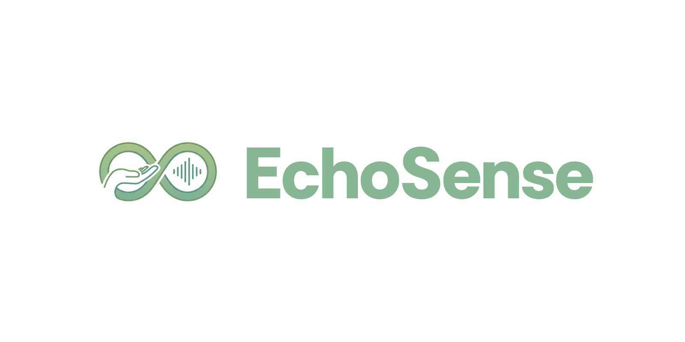
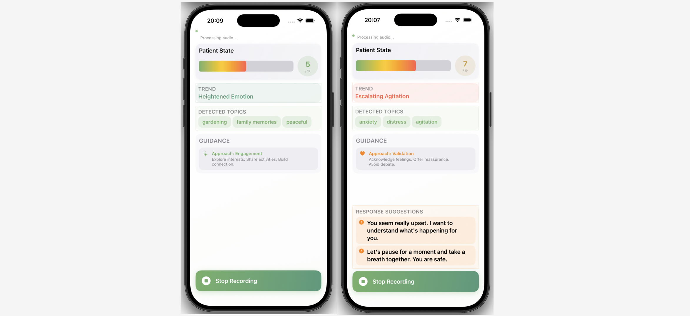

# EchoSense: Audio Intelligence for Dementia Care

Real-time AI communication assistant for dementia caregivers. Analyzes speech acoustics + conversation context to provide person-centred care nudges. Runs on-device (iPhone 12+) with MedGemma-1.5-4b.

## ✨ Features

- 🎤 **9 acoustic biomarkers** (articulation, loudness, spectral) + context analysis
- 🧠 **MedGemma-1.5-4b** (4-bit quantized, <2GB) for VIPS-aligned PCDC guidance
- 📱 **On-device inference** — privacy-first, works offline
- 💾 **Rolling memory** — adapts to patient history across sessions

## 🔬 Technical Details

### Acoustic Biomarkers (9 Features)

| Feature | Cohen's d | Description |
|---------|-----------|-------------|
| articulation_variability | 0.233 | Formant frequency variation |
| spectral_tilt | 0.152 | High/low frequency balance |
| loudness_mean | 0.134 | Average vocal intensity |
| loudness_variability | 0.128 | Loudness modulation |
| intensity_score | 0.119 | Categorical intensity (0-10) |
| loudness_peaks_per_sec | 0.112 | Energy burst frequency |
| spectral_clarity_score | 0.110 | Voice quality (0-5) |
| voiced_segments_per_sec | 0.106 | Speech rate |
| spectral_flux | 0.103 | Spectral change rate |

**Data**: 232 samples from [DementiaNet](https://github.com/shreyasgite/dementianet) (116 dementia, 116 controls)

## Model

- **Base**: MedGemma-1.5-4b (4.1B params)
- **Quantization**: 4-bit per-channel (16GB → 2GB, 8× compression)

## Status

### ✅ Done
- Extracted and validated 9 acoustic biomarkers from DementiaNet audio.
- Integrated MedGemma-1.5-4b with VIPS-aligned PCDC prompts.
- Quantized model to 4-bit (<2GB) for on-device CoreML inference.
- Demo iOS app with real-time nudges, trend display, and rolling memory.

### 🔮 Future Work
- [ ] ASR (Apple Speech / Whisper-Tiny) + speaker diarization
- [ ] Fine-tune on 500+ labeled conversations
- [ ] UX: Onboarding, profile wizard, session dashboard
- [ ] **Clinical validation**: 20-30 patients, 4-week pilot
- [ ] Multi-language support (Spanish, Mandarin, French)

## ⚖️ Disclaimers

**⚠️ Not a diagnostic tool** — Provides communication guidance only, not medical advice.  
**Privacy-first** — All processing on-device; no data transmission.  
**Research prototype** — Not approved for clinical use.

## 📄 License & Author

**MIT License** — see [LICENSE](LICENSE)  
**Victrix Yan** | Department of Bioengineering, Imperial College London  
📧 qingchen.yan24@imperial.ac.uk

## 🙏 Acknowledgments

[openSMILE](https://github.com/audeering/opensmile) • [Google MedGemma](https://ai.google.dev/gemma) • [DementiaNet](https://github.com/shreyasgite/dementianet) • Apple CoreML

